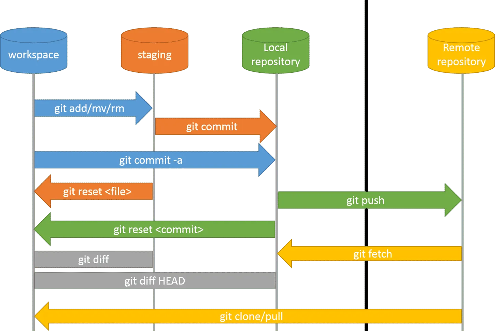
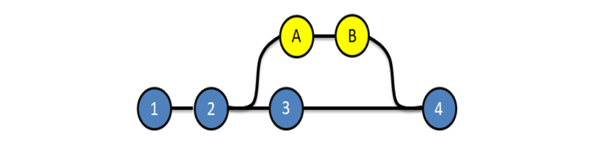
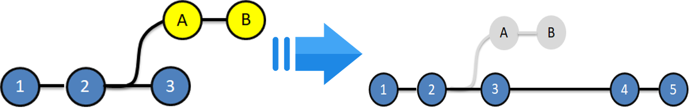

```{r setup, include=FALSE}
knitr::opts_chunk$set(eval = FALSE)
# knitr::opts_chunk$set(echo = FALSE, message = FALSE, warning = F,fig.pos = "!h",out.width='1200px')

```

# Main knowledge {.tabset .tabset-fade}


## First commit

add new branch: https://github.com/Ferran-pv/sp-scripts -> clicar a "main" (nom default branch)

```{r}
git config --global user.email "ferranpauls10@gmail.com"
git config --global user.name "Ferran-pv"
#
git init
git remote add origin https://github.com/Ferran-pv/sp-scripts.git
cd /home/pferran/scripts
git add .
git commit -m "Initial commit" 
git push -u origin main # Careful: name of branch will be 'main'.
```

## normal push

```{r}
cd /home/pferran/scripts
git add . 
git commit -m backup
git push -u origin main
```

<!-- ############################################################### -->


# Useful stuff {.tabset .tabset-fade}

## Clone repository

```{r}
git clone http[...].git
```

## Reversing changes

reset = local, revert = remote.

```{r}
git reset --hard HEAD~1 # 1 commit before head
git revert HEAD
```

## Fetch/pull

```{r}
git fetch
git merge origin main

# or, same thing
git pull
```


## Branching 

### New branch & change to it

```{r}
git branch <name>
git switch <name> # or checkout
```

### Branch union

2 options: merge & rebase.

```{r}
git switch X # change to branch created to maintain the other stable
git commit # save changes
git switch main 
git commit
# We are in 'main' branch.

########## merge
git merge bugFix # update main branch with changes.

########## rebase
git switch X
gitrebase main


```


<!-- ############################################################### -->


# Definitions {.tabset .tabset-fade}





## Main knowledge 

<span style="color:blue">**add:**</span> takes a modified file in your working directory and places the modified version in a staging area (tracked files).

<span style="color:blue">**commit:**</span> records a snapshot of all the (tracked) files in your directory. It compresses a commit as a set of changes from one version of the local repository to the next.

<span style="color:blue">**head:**</span> A head is simply a reference to a commit object. At any given time, one head is selected as the 'current head' (i.e. latest commit in the branch you are in). This head is aliased to **HEAD**.

<span style="color:blue">**fetch:**</span> download non-updated changes from a remote repository.

- Doesn't change your local <main>.

<span style="color:blue">**pull:**</span> fetches remote changes and then merges them.

<span style="color:blue">**push:**</span>  uploading your changes to a specified remote ("publish" your work).


## Branching

<span style="color:blue">**merge:**</span> To include the changes from one branch to the other branch.

- History is mantained.
- If you do it multiple times, the final squeme is messy.



<span style="color:blue">**rebase:**</span>  logs are modified after <merge>. 

- Goal:make logs of repository history look linear.
- Problem: we cannot track when & how the commits were merged.



## Reversing changes

<span style="color:blue">**reset:**</span> will move a branch backwards as if the commit had never been made. Only in your local repository, not commited changes.

<span style="color:blue">**revert:**</span> reverse changes and share those reversed changes with others (i.e. applies to commited changes).


